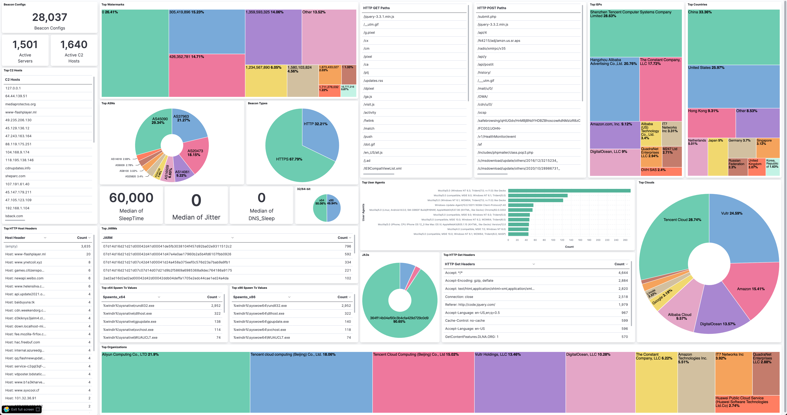

# Cobalt Strike 

Overview
=========
This directory contains research and reporting related to Cobalt Strike, a threat emulation framework. 

## Indicators :biohazard:
Cobalt Strike indicators provided as-is from IronNet's Threat Research Teams. The indicators are presented as follows:
* [`Team Servers`](#Team-Servers-joystick): Cobalt Strike Team Servers identified in the wild.
* [`Beacon Configs`](#Beacon-Configs-page_facing_up): Extracted beacon configs.

Indicators will be posted on a weekly basis on Monday. If you would like a feed of active Team Servers in the wild, and 
the C2 Hosts observed in the beacons they are serving , we recommend you subscribe to our 
[AlienVault OTX pulses](https://otx.alienvault.com/user/IronNetTR/pulses).

### How Collections are Performed :pencil:
IronNet’s Threat Analysis Team routinely scans the public IPv4 space on top ports for cobalt strike servers. It is 
cumbersome and inefficient to scan every public IPv4 IP address, so we use fingerprinting methods like JARM as a lead 
generator for our analysis. We start with leads generated from the most popular JARMs for Cobalt Strike derived from our 
research. JARM is not a silver bullet by itself. It does a wonderful job of identifying the underlying TLS stack 
implemented (python 3 with aiohttp 3, Java 11, etc.), but as you can imagine, this can cause some overlap in detection 
if none or minor changes are made to the default implementation. We then probe these servers to see if we can get a 
beacon served back to us.

#### How do we get the Team Server to serve us a payload?
Analyzing the decompiled code of Cobalt Strike, we can see that it uses a checksum of the URL leveraging an algorithm 
called checksum8 to serve the 32-bit and 64-bit versions of the payload. Below is an example where we used a bruteforce 
value for a 32-bit and 64-bit  payload respectively. Querying a Cobalt Strike server that has Metasploit compatibility 
enabled, with those HTTP paths, should return us a respective payload. 

**Note:** We use a common user-agent string because Cobalt Strike typically filters abnormal user-agents. 

If we are successfully served a 32/64-bit beacon, we can then extract the beacon config. In the beacon config, there are 
network indicators of compromise (domains, IPs, HTTP paths, user-agents, etc.) that we can immediately action.  However, 
we can additionally extract behavior indicators from the beacon config (e.g. jitter) which, our analytics can directly 
use to train off of. While indicators like domain, and IP can rotate, capturing these behavioral features will allow us 
to better align our analytics with true malicious behaviors.  

*Credits and special thanks to [Te-k](https://github.com/Te-k/cobaltstrike) and his blog post 
[Analyzing Cobalt Strike for Fun and Profit](https://www.randhome.io/blog/2020/12/20/analyzing-cobalt-strike-for-fun-and-profit/)*

### Team Servers :joystick:
We identify Cobalt Strike Team Servers by those that successfully serve us a Cobalt Strike `x86` (32-bit) and/or `x64` 
(64-bit) beacon. We look for servers that are distributing DNS/HTTP/HTTPS beacons.

### Beacon Configs :page_facing_up:
Extracted beacon configs in `JSON` format.

#### Special fields
Along with the typical fields you would expect to be extracted from Cobalt Strike beacons, we include the following:
* `jarm`: JARM fingerprint of the Team Server that served us the beacon.
* `C2Host`: A *list* of command and control hosts extracted from the `C2Server` field in order.
* `HttpGetPath`: A *list* of HTTP GET Paths extracted from the `C2Server` field in order.
* `payload_md5`: MD5 hash of beacon
* `payload_sha1`: SHA1 hash of beacon
* `payload_sha256`: SHA256 hash of beacon
* `payload_size`: Size of beacon (bytes)

## Help / Contact Us :construction_worker:
Feel free to reach out to us on Twitter [@IronNetTR](https://twitter.com/IronNetTR). 